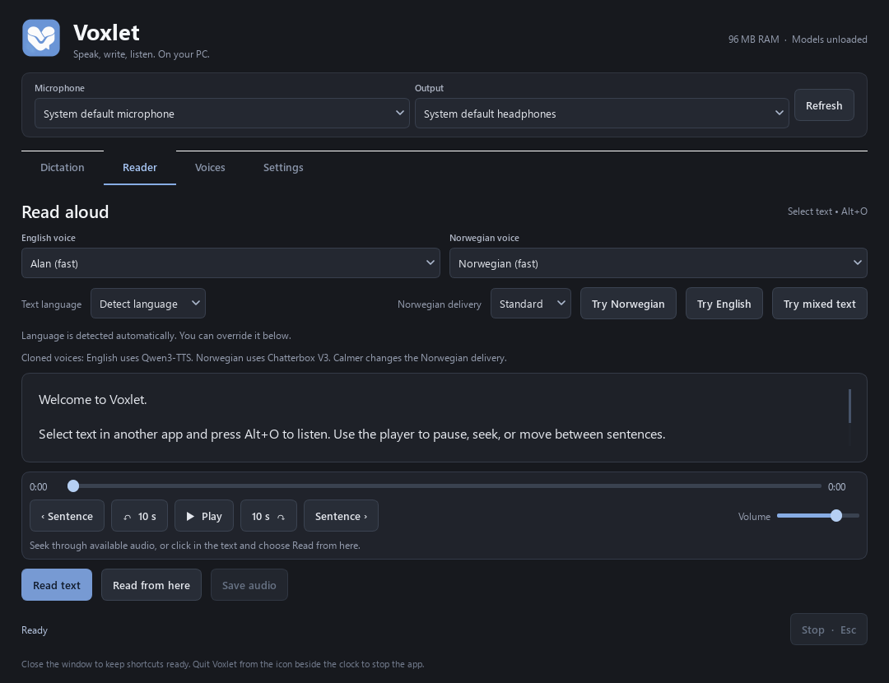

<p align="center"></p>

# Voxlet

**Speak, write, listen. On your PC.**

Voxlet is a native Windows app for dictation, reading selected text aloud, and
creating local reference voices. It has an English interface, supports English
and Norwegian, and uses local speech models after setup. It does not need a
browser, an API subscription, or a cloud transcription service.

**[Download the Windows release](https://github.com/KrisEie/voxlet/releases/latest)**
 · [Install from source](#install-from-source) · [First steps](#first-steps)

This is an early public release. Norwegian voice cloning can mispronounce words,
particularly English words in Norwegian sentences, and does not guarantee your
exact dialect or voice identity. Review dictation before using it.



## What you can do

- Dictate into the text field you are using, with a global keyboard shortcut.
- Select text in another app and have it read aloud.
- Pause, seek, jump ten seconds, or move between sentences during reading.
- Choose separate default voices for English and Norwegian.
- Test the microphone, play the recording back, and adjust gain and automatic level.
- Record a reference voice or import audio from a video, including MP4 and MOV clips.
- Select a 3–90 second part of an imported file and generate its transcript locally.
- Rename or delete voices in the library.
- Keep shortcuts available with the window hidden, or quit the app completely.

## Download and install on Windows

1. Open **[Releases](https://github.com/KrisEie/voxlet/releases/latest)** and download
   **`Voxlet-0.1.0-windows-x64.zip`** under **Assets**. GitHub's automatic “Source
   code” ZIP is a different download; it works with the source instructions below.
2. Extract the entire ZIP to a writable folder, for example `Documents\Voxlet`.
   Keep all the files together. Do not run the app inside the ZIP or copy only the EXE.
3. Double-click **`Setup.cmd`**. Leave its window open until it says setup is complete.
   Setup installs its own Python runtimes inside the app folder and downloads the
   public models. You do not need to install Python manually or use administrator access.
4. Open **`Voxlet.exe`**, **`Start.cmd`**, or the desktop shortcut created by setup.
5. Choose your microphone and output device at the top of the app. Use **Test
   microphone**, speak for a few seconds, stop, and choose **Play test**.

The download contains the desktop app and its source, **not** the large speech
models. Initial setup needs an internet connection and can take a while. Models
run locally afterward; speech is not sent to the model publishers.

### Standard setup or voice cloning?

| Setup | Included capabilities | Hardware |
| --- | --- | --- |
| `Setup.cmd` | English/Norwegian dictation, language detection, two fast reading voices, audio/video import | Windows 10/11 x64; CPU works |
| `Setup.cmd full` | Everything above, plus English Qwen cloning and Norwegian Chatterbox cloning | A compatible NVIDIA GPU and CUDA driver |

For cloning, open a terminal in the extracted folder and run `Setup.cmd full`.
You can run it after the standard setup. Downloads are resumable and models are
reused when already present. Setup validates CUDA before downloading cloning models.

Allow roughly **25 GB of free disk space for standard setup** and **50 GB for
full setup**, including caches and Python environments. These are conservative
setup budgets, not the size of the app download. Disk use depends on caches and
installed packages. The reference test machine uses an RTX 4090 with 24 GB VRAM;
performance and compatibility on other GPUs have not been validated.

The public setup uses **CPU transcription by default** so it does not depend on
someone else's CUDA DLLs or another installed app. Large-model dictation may be
slow on a CPU. Advanced users can configure their own working CTranslate2 CUDA
environment through the ignored `runtime.json` file; see [Architecture](#architecture).

## First steps

### Dictation

The default shortcut is **Ctrl+Shift+Space**:

1. Put the cursor in a text field.
2. Press the shortcut to start recording.
3. Speak, then press the shortcut again to stop and transcribe.

Voxlet pastes the result into the original field if the focus still matches.
It does **not** press Enter or Send. If focus changed, the text stays in
**Dictation**, where you can review and copy it. Password fields are excluded.
Some elevated apps and games can block input; this is not guaranteed to work in
every text field.

Use **Norwegian**, **English**, or **Detect language**. Accurate Norwegian
transcription uses NB-Whisper Large. Turn off the accuracy setting to use the
general Whisper Turbo model instead. Short recordings can be difficult to
classify; selecting a language avoids that ambiguity.

### Reading selected text

The default shortcut is **Alt+O**:

1. Select text in a browser, document, or another app.
2. Press **Alt+O** to read it. While reading, the same shortcut pauses or resumes.

You can also paste text into **Reader** and choose **Read text**. The player lets
you seek through generated audio, jump ten seconds, and move between sentences.
**Read from here** starts at your text selection or cursor. **Save audio** exports
a WAV file; save it before playback finishes if automatic deletion is on.

In **Settings → Apply shortcuts**, choose your own shortcuts. **Alt+P** is reserved
because it can conflict with SteelSeries Moments. **Esc** cancels the current
recording or reading and clears its temporary audio.

### Create your own voice

1. Install cloning with `Setup.cmd full` if you want to read in a reference voice.
2. Open **Voices → Create a voice**.
3. Enter a name. Choose a recording prompt, upload audio/video, or record directly.
4. For an upload, adjust **Start** and **Length**, then choose **Use this clip**.
5. Play the sample back. Review the detected language and correct the transcript
   so it matches the actual words spoken.
6. Choose **Save voice**, then assign it with **Use for English** or **Use for Norwegian**.

The full Norwegian prompt starts with “YouTube”, “screenshot”, and “voiceover”.
Aim for **45–90 seconds** in your normal speaking voice and dialect. A shorter
Norwegian prompt and an English prompt are also available. Choose a quiet clip
with one speaker; the importer does not separate speech from music or other voices.

Supported imports include WAV, MP3, M4A, FLAC, OGG, MP4, MOV, MKV and WebM.
Original files are not changed. Silent edges are trimmed with a small margin;
internal pauses remain. A saved reference conditions the model—it does not train
a new model to pronounce every word you read.

In Reader, **Try Norwegian**, **Try English**, and **Try mixed text** provide quick
examples. **Standard** and **Calmer** adjust Norwegian cloning delivery through
model settings; audio is not artificially sped up or pitch-shifted.

### Delete a voice

Open **Voices**, select the voice, and choose **Delete voice**. Confirm its name.
Voxlet removes that profile and its app-owned personal reference sample.
Original uploads and exported audio remain. If the deleted voice was a default,
Reader selects another available voice or the fast standard voice. You can also
remove the last library voice: the two fast voices remain available.

## Closing the app and memory

Closing the window normally hides Voxlet in the notification area beside the
clock. Its shortcuts still work. Click its icon or reopen the app to restore the
window. Right-click the icon and choose **Quit Voxlet** to stop the app, its owned
workers, and the shortcuts.

You can turn off **Keep shortcuts available** so closing the window quits it.
**Start Voxlet with Windows** is optional and off until you enable it.

No speech model loads at startup. Cloning engines unload after approximately
45 seconds idle; transcription workers stop after each operation. The desktop
process was observed at roughly 100–150 MB RAM on the reference PC. Model use
requires considerably more RAM/VRAM, and cold starts are slower than later reads.

## Privacy and local files

**No personal voice recordings, voice profiles, transcripts, or user settings
are included in this repository or the release ZIP.** The cloned-voice library
starts empty. The only initial reading voices are the downloaded Piper voices.

Files stay in the extracted app folder:

| Folder | Purpose |
| --- | --- |
| `user-data/` | Settings, your saved voice library, reference samples, temporary sessions |
| `models/` | Downloaded transcription and Piper model weights |
| `.cache/huggingface/` | Downloaded cloning models and Hugging Face download cache |
| `.cache/uv/` | Installation package cache |
| `.runtime/` | Isolated Python runtimes and the setup tool |
| `media-tools/` | FFmpeg downloaded by setup |

Temporary reading audio is deleted after playback by default. Turn that setting
off to replay it until Esc, the next reading, or quitting. Saved voices and
deliberate audio exports are kept. Voice files are not encrypted; treat them as
personal data. The repository ignores all runtime data and recordings.

Setup contacts GitHub, Python/package hosts and Hugging Face to download software
and model files. Model publishers receive normal download requests, not your
recorded speech. There is no account, analytics service, or upload feature in
Voxlet. Hugging Face telemetry is disabled. Back up `user-data/` yourself before
moving or replacing an installation.

## Models and licenses

| Task | Model / project |
| --- | --- |
| Norwegian dictation | [NB-Whisper Large](https://huggingface.co/NbAiLab/nb-whisper-large), National Library of Norway |
| English dictation and language detection | [Whisper Large-v3 Turbo in CTranslate2 format](https://huggingface.co/dropbox-dash/faster-whisper-large-v3-turbo) |
| Fast reading | [Piper](https://github.com/OHF-Voice/piper1-gpl), Alan and Norwegian talesyntese |
| English cloning | [Qwen3-TTS-12Hz-1.7B-Base](https://huggingface.co/Qwen/Qwen3-TTS-12Hz-1.7B-Base), with [faster-qwen3-tts](https://github.com/andimarafioti/faster-qwen3-tts) |
| Norwegian cloning | [Chatterbox Multilingual V3](https://github.com/resemble-ai/chatterbox), Resemble AI |

Qwen's published language list does not include Norwegian, so the app routes
Norwegian cloning to Chatterbox. The app's cloning choices do not guarantee
correct pronunciation, a particular accent, or resemblance to a real speaker.

Voxlet's own source is [MIT licensed](LICENSE). Dependencies and model weights
retain their separate licenses; they are not all MIT. See
[THIRD_PARTY_NOTICES.md](THIRD_PARTY_NOTICES.md). Chatterbox's embedded audio
watermark is retained. Use your own reference voice or a speaker who has agreed
to its use.

## Install from source

Download **Code → Download ZIP** from this repository and extract it, or:

```powershell
git clone https://github.com/KrisEie/voxlet.git
cd voxlet
.\Setup.cmd
.\Start.cmd
```

Python is downloaded locally by setup. The normal UI launches through `pythonw`,
so no terminal needs to stay open. Run `.\Setup.cmd full` for cloning support.

For a development environment without model downloads or a desktop shortcut:

```powershell
.\Setup.ps1 -SkipModels -NoShortcut
.\.runtime\desktop\Scripts\python.exe -m unittest discover -s tests -v
.\build.ps1
```

This builds `dist\Voxlet\Voxlet.exe` and a clean release ZIP in `release\`.
Setup scripts use a process-scoped execution policy when opened through the CMD
launcher; they do not change the system execution policy. If an administrator
restricts scripts on your machine, follow that administrator's policy.

## Architecture

### Release validation

The first Windows release was checked with a fresh standard and full installation.
CPU transcription and Piper reading were exercised in English and Norwegian,
including audio import from a generated MP4. Both cloning workers generated audio
on an RTX 4090 using synthetic standard-voice references. No personal voice was
used in the public-release tests. Eleven automated checks also run in GitHub
Actions; they cover portability, the empty library, safe deletion, text/language
handling, and desktop initialization. These are functional checks, not a broad
accuracy benchmark or a test of every microphone and GPU.

### Components

The PySide6 desktop process owns recording, playback, shortcuts, and clipboard
integration. Speech runs in separate, on-demand processes:

- `worker.py`: faster-whisper / CTranslate2 and Piper.
- `qwen_worker.py`: English streaming cloning with CUDA.
- `chatterbox_worker.py`: Norwegian cloning, one generated sentence at a time.
- `engines.py`: worker ownership, cancellation, reference library, temporary sessions.
- `portable_config.py`: paths calculated from the installation directory.

Independent environments keep conflicting Transformers versions apart. Qwen
pins Transformers 5.15.1; Chatterbox pins 5.2.0. The setup deliberately installs
the pinned Chatterbox source without its dependency resolver, with an explicit
dependency list and PyTorch 2.7.1, matching the reference implementation.

For custom runtime locations, create an ignored `runtime.json` in the app folder
with overrides such as `worker_python`, `qwen_python`, `multilingual_python`,
`asr_device` and `cuda_dirs`. Paths are local configuration and should never be
committed. Every install has a separate single-instance identifier, so a test
copy does not close or reuse another installation.

## Troubleshooting

- **No sound / wrong mic:** choose devices at the top, refresh them after reconnecting,
  and run a microphone test. If you use SteelSeries Sonar, its selected virtual
  channel must route to your physical headset in SteelSeries GG.
- **Shortcut unavailable:** another app owns it. Choose a different combination
  in Settings. Closing Voxlet to the tray keeps its shortcut registration active.
- **Slow first read:** the model is loading. Fast voices have a smaller startup cost.
- **Cloning tools missing:** run `Setup.cmd full`, then select a saved reference voice.
- **CUDA error:** check GPU/driver compatibility. Standard setup and fast voices
  still work without CUDA. Clone generation has been tested on the reference GPU only.
- **Model download failed:** rerun setup. Keep the extraction folder in place and
  make sure you have enough free disk space and internet access.
- **No audio in an upload:** choose a file with an audio track and a non-silent clip.
- **Wrong Norwegian words:** choose Norwegian explicitly, use accurate transcription,
  add useful names/terms in Settings, and review the result. Dialect and mixed-language
  speech can still be difficult.
- **Moving the folder:** recreate the desktop shortcut with setup and update any
  explicit paths in `runtime.json`. Saved voice profiles also store their reference
  paths; recreate those profiles or update their paths in `user-data/voices.json`.
  Remove the old autostart entry through the
  old installation's Settings before moving it.

For bug reports, include Windows version, GPU model, setup mode, and steps to
reproduce. Do not attach private recordings or `user-data/` unless you deliberately
want to share them.
